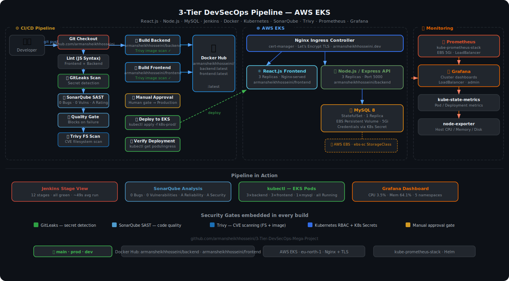
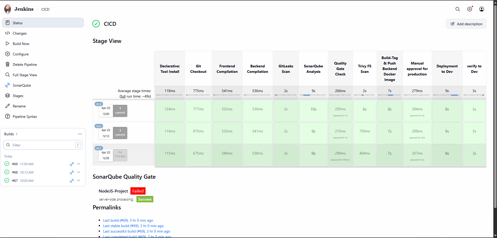
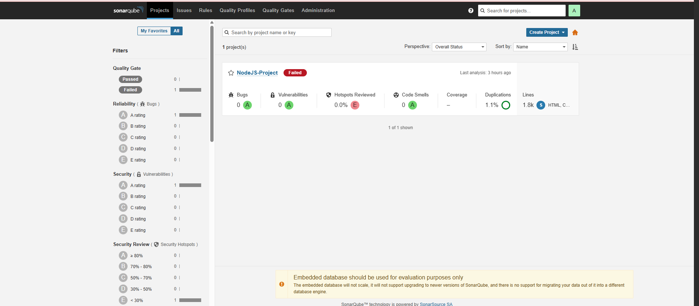
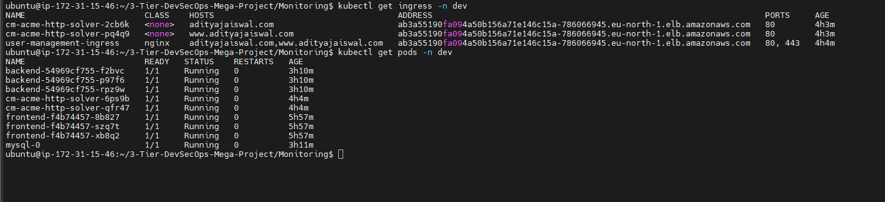
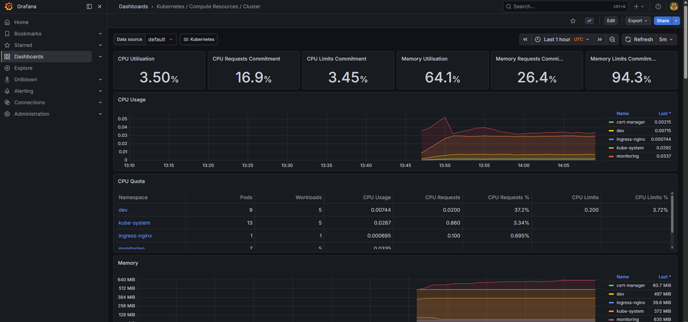

# 3-Tier DevSecOps Mega Project


A **production-grade, end-to-end DevSecOps pipeline** for a full-stack user-management application — from a single `git push` all the way to a secured, TLS-terminated, monitored Kubernetes cluster on **AWS EKS**, with security gates at every stage of the pipeline.

---

## Architecture



---

## Pipeline in Action

### Jenkins — All Stages Green



12 automated stages with an average run time of ~49 seconds. Every build runs secret detection, SAST, quality gate enforcement, and container vulnerability scanning before a single image reaches the registry.

### SonarQube — Code Quality Analysis



- **0 Bugs** · **0 Vulnerabilities** · **A Reliability** · **A Security**
- 1.8k lines of HTML/JS analysed per build
- Quality Gate blocks deployment automatically on regression

### AWS EKS — Production Pods Running



All workloads healthy in the `dev` / `prod` namespace:
- `backend` × 3 replicas (Node.js)
- `frontend` × 3 replicas (React / Nginx)
- `mysql-0` StatefulSet with EBS persistent volume
- Nginx Ingress with AWS ELB + Let's Encrypt TLS

### Grafana — Live Cluster Monitoring



`kube-prometheus-stack` deployed via Helm, scraping all namespaces.
Real-time CPU, memory, and workload visibility across `dev`, `ingress-nginx`, `kube-system`, and `monitoring` namespaces.

---

## Tech Stack

| Layer | Technology |
|---|---|
| Frontend | React.js (multi-stage Docker build → Nginx) |
| Backend | Node.js / Express REST API |
| Database | MySQL 8 — StatefulSet + AWS EBS (5 Gi) |
| Containerisation | Docker + Docker Hub (`armansheikhhosseini/`) |
| Orchestration | Kubernetes on AWS EKS |
| Ingress / TLS | Nginx Ingress Controller + cert-manager (Let's Encrypt) |
| CI/CD | Jenkins declarative pipeline |
| Secret scanning | GitLeaks |
| SAST / Code Quality | SonarQube + Quality Gate |
| Vulnerability scanning | Trivy — filesystem scan + Docker image scan |
| Monitoring | Prometheus + Grafana + kube-state-metrics + node-exporter |
| IaC / GitOps | Helm (monitoring stack), kubectl manifests |

---

## DevSecOps Pipeline Stages

```
Stage  1 │ Git Checkout           pull latest from main branch
Stage  2 │ Frontend Compilation   syntax-check all client JS
Stage  3 │ Backend Compilation    syntax-check all API JS
Stage  4 │ GitLeaks Scan          detect secrets / credentials in source
Stage  5 │ SonarQube Analysis     SAST — static code analysis
Stage  6 │ Quality Gate Check     auto-abort pipeline on gate failure
Stage  7 │ Trivy FS Scan          scan filesystem for CVEs → fs-report.html
Stage  8 │ Build & Push Backend   docker build → trivy image scan → push
Stage  9 │ Build & Push Frontend  docker build → trivy image scan → push
Stage 10 │ Manual Approval        human gate before production
Stage 11 │ Deploy to EKS          kubectl apply all k8s-prod/ manifests
Stage 12 │ Verify Deployment      kubectl get pods && kubectl get ingress
```

---

## Repository Structure

```
.
├── api/                        # Node.js / Express backend
│   ├── controllers/
│   ├── middleware/
│   ├── models/
│   ├── routes/
│   └── Dockerfile
├── client/                     # React.js frontend
│   ├── src/
│   └── Dockerfile              # multi-stage → Nginx
├── k8s-prod/                   # Kubernetes manifests (prod namespace)
│   ├── sc.yaml                 # AWS EBS StorageClass
│   ├── mysql.yaml              # StatefulSet + Secret + ConfigMap
│   ├── backend.yaml            # Deployment (3 replicas) + Service
│   ├── frontend.yaml           # Deployment (3 replicas) + Service
│   ├── ingress.yaml            # Nginx Ingress + TLS (Let's Encrypt)
│   └── ci.yaml                 # cert-manager ClusterIssuer
├── Monitoring/
│   └── values.yaml             # Helm values — kube-prometheus-stack
├── docs/
│   ├── architecture.svg        # Pipeline architecture diagram
│   └── screenshots/            # Build evidence for reference
├── docker-compose.yaml         # Local development stack
├── Jenkinsfile_CICD            # Main CI/CD pipeline
└── Jenkinsfile-slack_notifications   # Slack alerting pipeline
```

---

## Branches

| Branch | Purpose |
|---|---|
| `main` | Stable, production-ready code |
| `prod` | Production environment deployments |
| `dev` | Development and integration work |

---

## Local Development

```bash
# Full stack in one command
docker compose up -d

# Frontend → http://localhost:3000
# Backend  → http://localhost:5000
# MySQL    → localhost:3306
```

Without Docker:

```bash
cd api    && npm install && npm start   # Backend  :5000
cd client && npm install && npm start   # Frontend :3000
```

---

## Kubernetes Deployment (EKS)

```bash
# Storage class (cluster-wide)
kubectl apply -f k8s-prod/sc.yaml

# Namespace workloads
kubectl apply -f k8s-prod/mysql.yaml    -n prod
kubectl apply -f k8s-prod/backend.yaml  -n prod
kubectl apply -f k8s-prod/frontend.yaml -n prod

# Ingress + cert-manager
kubectl apply -f k8s-prod/ci.yaml
kubectl apply -f k8s-prod/ingress.yaml  -n prod

# Verify
kubectl get pods    -n prod
kubectl get ingress -n prod
```

---

## Monitoring Setup (Helm)

```bash
helm repo add prometheus-community https://prometheus-community.github.io/helm-charts
helm repo update

helm upgrade --install monitoring prometheus-community/kube-prometheus-stack \
  -f Monitoring/values.yaml \
  -n monitoring --create-namespace
```

Grafana is exposed via `LoadBalancer`. Access it at the external IP — credentials in `values.yaml`.

---

## Security Highlights

| Control | Tool | What it catches |
|---|---|---|
| Secret leakage | GitLeaks | API keys, tokens, passwords committed by mistake |
| Code vulnerabilities | SonarQube | Injection flaws, insecure patterns, code smells |
| Deployment blocker | Quality Gate | Prevents regressions from reaching the registry |
| Filesystem CVEs | Trivy FS | Known vulnerabilities in dependencies |
| Image CVEs | Trivy Image | OS-level and package CVEs in built containers |
| Credential management | K8s Secrets | DB passwords never in plain env vars |
| TLS everywhere | cert-manager | Let's Encrypt certs auto-renewed on Ingress |
| Production gate | Jenkins input | No unreviewed code reaches `prod` namespace |

---

## Author

**Arman Sheikh Hosseini**
- GitHub: [@armansheikhhosseini](https://github.com/armansheikhhosseini)
- Docker Hub: [armansheikhhosseini](https://hub.docker.com/u/armansheikhhosseini)
